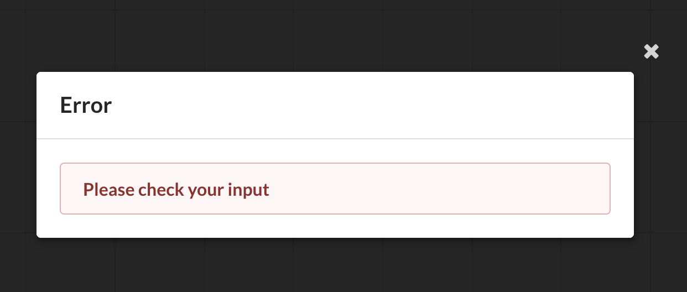

This project was bootstrapped with [Create React App](https://github.com/facebook/create-react-app).

## About

Chart Screen is a react hooks application (Hooks are a new addition in React 16.8. They let you use state and other React features without writing a class)

### Demo
Demo is available in: https://chartscreen.azurewebsites.net

### APIs Available

* See Israel's population from 2009 to 2019 - using api.population.io 
* See lastest Stocks volume available - using alphavantage API

### Filters

* Choose from several APIs
* Set number of data points to presented on chart (minimum is 2, default is 10)
* Set Threshold - will create a threshold line on chart + Mark datapoints that exceed the selected threshold in purple (default is 96% from the biggest datapoint)

### Errors

Errors will be delivered by error modal  
For example:

